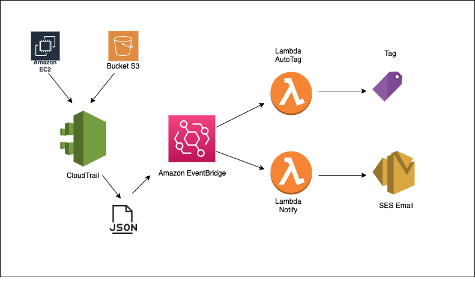

# Introdução
-----

Esta solução visa auto taggear recursos com o Owner(User criador do recurso) e notificar sobre recursos não taggeados corretamente. Todo novo recurso criado é registrado no CloudTrail, que gera um evento no formato JSON com as informações sobre este recurso, o CloudWatch EventBridge fica monitorando e assim que detecta a criação de um novo recurso, pega o evento do CloudTrail no formato JSON e aciona 2 funções Lambdas passando este JSON como parametro, uma das Lambdas cria uma Tag de forma automatica no recurso com a Key:"Owner" e Value:"Nome do usuário que criou". A outra função é acionada pelo mesmo evento e checa se o recurso criado recebeu as devidas Tags e em caso negativo envia uma notificação através do SES para o email configurado informando as Tags faltantes, quem criou, qual o recurso e qual a conta.
Obs. Solução funciona apenas para Instancias EC2, Buckets S3 e Instancias RDS.



## Deploy da Solução

A solução deve ser criada em cada região que deverá ser monitorada.

### Pré Requisitos
1 - Cloud Trail configurado em cada uma das regiões que receberão a solução;

2 - SES autorizado a enviar email pelo dominio que enviará o email.
É necessário configurar o SES apenas em uma região; (As outras regioes conseguem usar o SES em outras regiões)

### Deploy utilizando cloudformation

1 - Criar um bucket no S3 com o nome como por exemplo, **"auto-tag-resources"** e uma pasta com o nome **"auto-tag-resources"**;

2 - Na pasta criada dentro do bucket, fazer o upload dos arquivos **"auto-tag-resources.zip"** e **"auto-tag-notify-resources.zip"** contidos neste repositório;

3 - Baixar para sua maquina o arquivo do CloudFormation **"auto-tag-resources.json"** e realizar o deploy com o comando abaixo:

```
aws cloudformation create-stack --stack-name auto-tag-resources --template-body file://auto-tag-resources.json --capabilities CAPABILITY_NAMED_IAM  --parameters ParameterKey=pSupportingFilesBucket,ParameterValue=auto-tag-resources ParameterKey=pSupportingFilesPrefix,ParameterValue=auto-tag-resources/ --profile  <AWS_Profile> --region <AWS_Region>
```
4 - Acompanhar pelo console da AWS a conclusão do deploy da Stack pelo CloudFormation;

5 - Na função Lambda **"auto-tag-resources-notify"** configurar as variaves de ambiente conforme o modelo abaixo:

```
EMAIL_ADDRESS	["user_or_group@domain.com"]
EMAIL_SENDER	tags_notify@domain.com
TAGS_TO_CHECK	["squad","tribo","produto"]
```

Onde: <br>
    **"EMAIL_ADDRESS"** são os emails que receberão a notificação das Tags faltantes;<br>
    **"EMAIL_SENDER"** é o remetente das mesnsagens de email;<br>
    **"TAGS_TO_CHECK"** é a lista de Tags que serão checadas.<br>

Modelo do email recebido:
```
O Bucket esta sem a(s) Tag(s) necessárias:

TAG: produto
Conta AWS: 12345678900
Bucket Name: my-bucket
Usuario criador: fulano@domain.com
```
